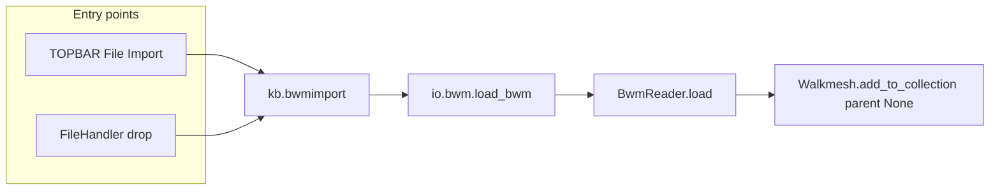

# Standalone walkmesh (BWM) import path

## Context (current behavior)

- `[io_scene_kotor/io/mdl.py](io_scene_kotor/io/mdl.py)` is the **only** production caller of `BwmReader` / `Walkmesh.add_to_collection`. Area `.wok` beside an MDL is merged into the MDL `AabbNode` (`roomlinks`, `compute_lyt_position`) and is **not** instantiated as its own object tree. PWK/DWK are parented under `**model_root`**.
- `[io_scene_kotor/format/bwm/reader.py](io_scene_kotor/format/bwm/reader.py)` branches on header `bwm_type`: area WOK vs PWK/DWK; naming uses the second ctor arg `model_name` (today the MDL’s `model.name`).
- `[io_scene_kotor/ops/file_handler_drop.py](io_scene_kotor/ops/file_handler_drop.py)` wires FileHandlers only for `.mdl`, `.mdl.ascii`, `.lyt`, `.pth` — no walkmesh extensions yet.
- Repo research + code review: `**parent_obj is None`** at the top of `import_nodes_to_collection` is acceptable (children still parent correctly); caveats are **MDL export** only walks from selected MDL root, `**find_mdl_root_of`** returns `None` for standalone trees — document in operator `bl_description` / tooltip.

## Design choices

| Topic         | Decision                                                                                                                                                                                                                                      |
| ------------- | --------------------------------------------------------------------------------------------------------------------------------------------------------------------------------------------------------------------------------------------- |
| IO module     | Add `[io_scene_kotor/io/bwm.py](io_scene_kotor/io/bwm.py)` with `load_bwm(operator, filepath, options)` mirroring texture/lightmap path bootstrapping from addon prefs (same pattern as `[load_mdl](io_scene_kotor/io/mdl.py)` lines 84–106). |
| `model_name`  | `os.path.splitext(os.path.basename(filepath))[0]` so standalone names match the file stem (differs from MDL+WOK where internal model name is used — acceptable and worth one line in the operator description).                               |
| Parent object | Pass `**None`** into `Walkmesh.add_to_collection` so the walkmesh root dummy sits at world root (review-approved). Optional follow-up: add a “parent to empty” property later for UX only.                                                    |
| Single `.dwk` | Import **only the dropped file**. Full door sets (`0.dwk`/`1.dwk`/`2.dwk`) remain the **MDL import** path; state this in `bl_description` to avoid false expectations.                                                                        |
| Export        | **Out of scope** for this slice (export still requires MDL root + existing `save_mdl` walkmesh logic).                                                                                                                                        |

## Implementation steps

1. **Scene graph: optional parent**
  - In `[io_scene_kotor/scene/model.py](io_scene_kotor/scene/model.py)` `import_nodes_to_collection`, set `obj.parent = parent_obj` **only if** `parent_obj is not None`. Widen the type hint to `bpy.types.Object | None`.  
  - In `[io_scene_kotor/scene/walkmesh.py](io_scene_kotor/scene/walkmesh.py)`, change `add_to_collection(self, parent_obj, ...)` to accept `bpy.types.Object | None` and document that `None` means world-root walkmesh import.
2. **IO: `load_bwm`**
  - New `[io_scene_kotor/io/bwm.py](io_scene_kotor/io/bwm.py)`: validate file exists; build `ImportOptions` consumer can pass in from operator; fill `texture_search_paths` / `lightmap_search_paths` from prefs when empty (copy the `try`/`kotor_addon_preferences` / `semicolon_separated_to_absolute_paths` block from `load_mdl`); `walkmesh = BwmReader(filepath, stem).load()`; `walkmesh.add_to_collection(None, bpy.context.collection, options)`; `operator.report` success.
3. **Operator**
  - New module e.g. `[io_scene_kotor/ops/bwm/importop.py](io_scene_kotor/ops/bwm/importop.py)` (or `walkmesh/importop.py` if you prefer naming): `KB_OT_import_bwm`, `bl_idname = "kb.bwmimport"`, `ImportHelper`, `filter_glob` default `"*.wok;*.pwk;*.dwk"` (per [Blender `ImportHelper` / multi-glob](https://docs.blender.org/api/current/bpy_extras.io_utils.html)), override `invoke` to `execute` when `self.filepath` is set (same as `[KB_OT_import_pth](io_scene_kotor/ops/pth/importop.py)`). Build `ImportOptions()` with `import_geometry=True`, `import_animations=False`, `import_walkmeshes=True`, `build_armature=False` (animations irrelevant).  
  - `execute`: try/except, `logger().exception`, `report({"ERROR"}, ...)`.
4. **Registration and menu**
  - `[io_scene_kotor/__init__.py](io_scene_kotor/__init__.py)`: import operator class; append to `classes`; add `menu_func_import_bwm` → “KotOR Walkmesh (.wok/.pwk/.dwk)” on `TOPBAR_MT_file_import`; mirror unregister.
5. **FileHandler (drag-and-drop)**
  - In `[io_scene_kotor/ops/file_handler_drop.py](io_scene_kotor/ops/file_handler_drop.py)`: new class `KB_FH_import_bwm` with `bl_import_operator = "kb.bwmimport"` and `bl_file_extensions = ".wok;.pwk;.dwk"` (per [FileHandler API](https://docs.blender.org/api/current/bpy.types.FileHandler.html)). Extend `FILE_HANDLER_CLASSES` and export from `__init`__ like existing handlers.
6. **Tests**
  - New `[test/blender/test_ops_bwm_import_smoke.py](test/blender/test_ops_bwm_import_smoke.py)`: enable addon; write minimal `.wok` via existing `BwmWriter` + `Walkmesh.from_aabb_node` pattern from `[test_format_bwm_roundtrip.py](test/blender/test_format_bwm_roundtrip.py)`; call `bpy.ops.kb.bwmimport(filepath=...)`; assert scene contains expected object names (e.g. `{stem}_wok` / `{stem}_wok_wg` for WOK) or mesh child count. Optionally second case for `.pwk` if a tiny writer path exists, or skip pwk/dwk smoke if building minimal binary is heavy (WOK-only smoke still validates the pipeline).
7. **Docs**
  - Update supported-formats table in `[AGENTS.md](AGENTS.md)` (and `[README.md](README.md)` if it duplicates the table): BWM **read** via dedicated import, not only via MDL.

## Dependency / risk summary

- **No PyKotor** required; pure `format/bwm` + scene.  
- **Blender 3.6–5.0**: FileHandler + `poll_file_object_drop` same as existing handlers.  
- Users who want PWK/DWK **exported with** an MDL must **parent** the imported walkmesh under the MDL root (existing export discovery) — call out in UI text.

